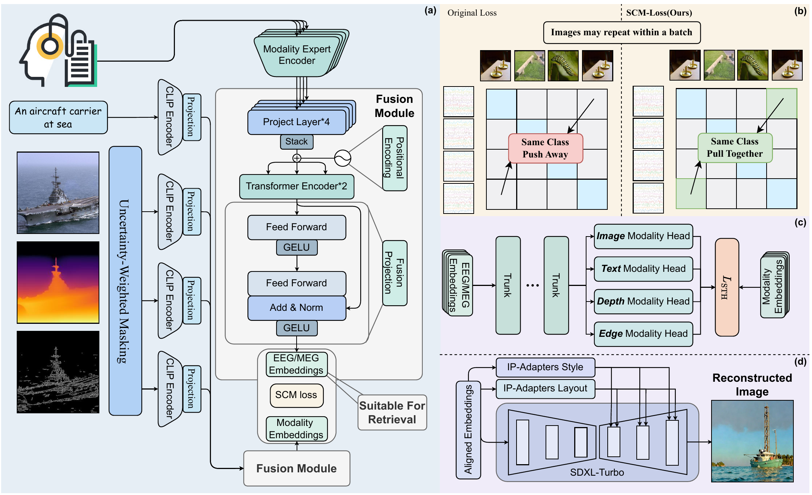
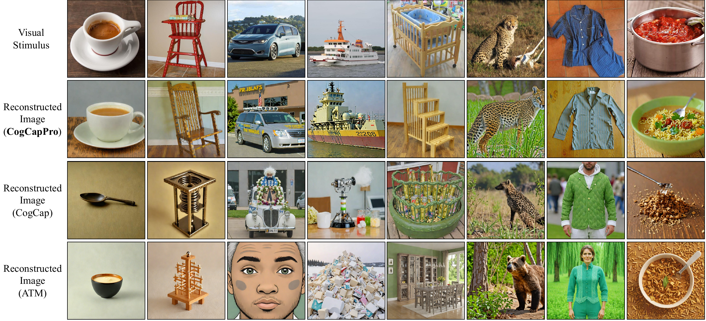

# CognitionCapturerPro

<p align="center">
  <strong>Towards High-Fidelity Visual Decoding from EEG/MEG via Multi-modal Information and Asymmetric Alignment</strong>
</p>

<p align="center">
  Kaifan Zhang, Lihuo He, Junjie Ke, Yuqi Ji, Lukun Wu, Lizi Wang, Xinbo Gao
</p>

<p align="center">
  <a href="https://arxiv.org/abs/2412.10489">
    
</p>

> TODO: replace the temporary arXiv badge target and update the manuscript metadata after the paper is publicly available.

<p align="center">
  
</p>

<p align="center">
  
</p>

## Overview

Brain decoding aims to recover perceptual content from neural signals, but high-fidelity visual decoding remains difficult because neural representations are affected by both **fidelity loss** and **representational shift**. Our CognitionCapturerPro (CogCapPro) addresses these issues by jointly modeling EEG/MEG signals with images, text, depth maps, and edge maps, then aligning the learned representations to a reconstruction space for image synthesis.

Compared with the previous CognitionCapturer framework, CogCapPro introduces three main components: an uncertainty-weighted masking strategy for modeling fidelity loss, a fusion encoder for integrating modality-private and shared information, and a simplified asymmetric alignment module for efficient reconstruction. On the THINGS-EEG dataset, the paper reports a **25.9%** and **10.6%** improvement in Top-1 and Top-5 retrieval accuracy over CognitionCapturer, respectively.

This repository includes code for training, alignment, and image generation. The main entry points are:

- `main.py` for EEG/MEG training
- `python -m src.cogcappro.align.main` for feature alignment
- `python -m src.cogcappro.generate_image.batch_generate` for image generation

## Environment Setup

The codebase has been validated on Linux with Python 3.9. GPU acceleration is strongly recommended for training, alignment, and image generation.

1. Create and activate a Python 3.9 environment.
2. Install the dependencies:

```bash
cd /path/to/CogCapPro
pip install -r requirements.txt
```

The commands documented below can be run directly from the repository root.

## Dataset and Pretrained Models

Large datasets and foundation-model checkpoints are **not** bundled with this repository. Please download them from their public sources and place them in the directory structure expected by the runtime.

Suggested public sources:

- THINGS-EEG / prior preprocessing reference: `https://github.com/dongyangli-del/EEG_Image_decode`
- SDXL-Turbo: `https://huggingface.co/stabilityai/sdxl-turbo`
- IP-Adapter: `https://huggingface.co/h94/IP-Adapter`
- OpenCLIP: `https://github.com/mlfoundations/open_clip`

The `weights/` folder is not distributed through GitHub because it is too large. Please download it from Google Drive and place it under your local `weights_root`:

- `https://drive.google.com/drive/folders/1FS5Rv_q7LaNkTWogkZk-nfQTNjxuIKPZ?usp=sharing`

Expected external directory layout:

```text
<data_root>/
  ThingsEEG/
    Preprocessed_data_250Hz_whiten/
  THINGS-MEG/
    preprocessed_data/
    Image_text_description/

<weights_root>/
  CLIPRN50/
    RN50.pt
  Things_dataset/
    model_pretrained/
      sdxl-turbo/
      ip_adapter/
```

## Quick Start / Reproduction

The main reproduction path documented here is the verified **EEG** workflow: configuration, training, alignment, and image generation. Public config touchpoints are:

- `configs/local.yaml`
- `configs/cogcappro.yaml`
- `configs/cogcappro_meg.yaml`

### 1. Configure Local Paths

Create a local runtime config:

```bash
cp configs/local.example.yaml configs/local.yaml
```

Edit `configs/local.yaml`:

```yaml
paths:
  data_root: /path/to/external_data
  weights_root: /path/to/external_model_weights
  runs_root: runs
  diffusion_embeddings_root: /optional/path/to/diffusion_embeddings
  sdxl_root: /optional/path/to/sdxl-turbo
  ip_adapter_root: /optional/path/to/ip_adapter
  things_meg_image_description_root: /optional/path/to/meg_blip2_texts
```

Before training, verify the resolved config:

```bash
python main.py \
  --config configs/cogcappro.yaml \
  --subjects sub-01 \
  --brain_backbone EEGProjectLayer_multimodal_cogcap_list \
  --vision_backbone RN50 \
  --data_type EEG \
  --uncertainty_aware \
  --print_config
```

### 2. Train the EEG Model

Set a reusable experiment layout:

```bash
export EXP_ROOT=runs/readme_demo
export EXP_NAME=intra-subject_cogcappro_EEGProjectLayer_multimodal_cogcap_list_RN50
export SUBJECT_RUN=${EXP_ROOT}/${EXP_NAME}/sub-01_seed0
```

Launch training:

```bash
CUDA_VISIBLE_DEVICES=0,1 python main.py \
  --config configs/cogcappro.yaml \
  --subjects sub-01 \
  --devices 0,1 \
  --epoch 80 \
  --uncertainty_aware \
  --mask_count 1 \
  --vision_backbone RN50 \
  --data_type EEG \
  --seed 0 \
  --exp_setting intra-subject \
  --brain_backbone EEGProjectLayer_multimodal_cogcap_list \
  --lr 1e-4 \
  --save_dir ${SUBJECT_RUN}
```

Expected outputs:

```text
${SUBJECT_RUN}/lightning_logs/version_x/checkpoints/last.ckpt
${SUBJECT_RUN}/lightning_logs/version_x/cogcappro.yaml
${SUBJECT_RUN}/lightning_logs/version_x/test_results.json
```

### 3. Run Alignment

The alignment stage expects the full subject run directory, not a standalone checkpoint path:

```bash
CUDA_VISIBLE_DEVICES=0 python -m src.cogcappro.align.main \
  --exp_dir ${SUBJECT_RUN} \
  --device 0 \
  --epoch 1 \
  --lr 1e-4 \
  --model_type diffusion
```

Expected outputs:

```text
${SUBJECT_RUN}/precomputed_datasets/sub-01_train_dataset.pt
${SUBJECT_RUN}/precomputed_datasets/sub-01_val_dataset.pt
${SUBJECT_RUN}/diffusion_ckpt/diffusion_model_best.pth
${SUBJECT_RUN}/generated_datasets/generated_embeddings.pt
```

### 4. Generate Images

Generate reconstructions from the aligned embeddings:

```bash
CUDA_VISIBLE_DEVICES=0 python -u -m src.cogcappro.generate_image.batch_generate \
  --base_dir ${EXP_ROOT} \
  --config configs/cogcappro.yaml \
  --data_type EEG \
  --modality_mode all \
  --device cuda \
  --subjects sub-01
```

Expected outputs:

```text
${SUBJECT_RUN}/generated_image/all/
```

Monitor progress:

```bash
find ${SUBJECT_RUN}/generated_image/all -type f | wc -l
```

## Citation

If you find this repository useful, please consider citing our paper. Thanks😊!

```bibtex
@article{zhang2026cognitioncapturerpro,
  title   = {CognitionCapturerPro: Towards High-Fidelity Visual Decoding from EEG/MEG via Multi-modal Information and Asymmetric Alignment},
  author  = {TODO},
  journal = {TODO},
  year    = {2026},
  note    = {TODO}
}
```

## Acknowledgements

Our work builds on several public datasets, toolkits, and prior codebases. We thank the authors and maintainers of:

- THINGS-EEG / THINGS-MEG
- EEG_Image_decode
- OpenCLIP
- SDXL-Turbo
- IP-Adapter

## Contact

For any inquiries or further information, feel free to contact us at: zkaifan@163.com
